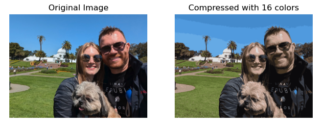
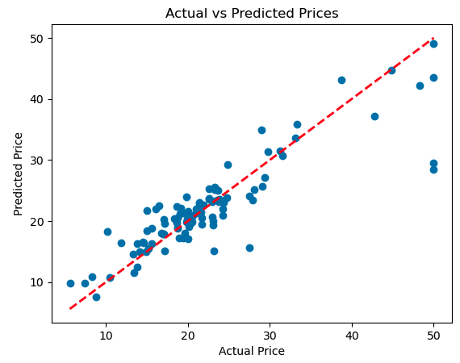

# Machine Learning

Labs related to everything **Machine Learning** and it contains Labs for different types of ML, like Linear Regression, K-Means, etc.

## K-Means

The [Lab for K-Means](Image_Compression_With_K-Means.ipynb) contains a Jupyter Notebook on how to compress images using K-Means.

### Example

In this example, the original image had **293.56 KB**, while the compressed image had **183.80 KB**.

## Linear Regression

The [Lab for Linear Regression](Predicting_Real_Estate_Prices_With_Linear_Regression.ipynb) creates a Real Estate Prices Prediction model using Linear Regression.

### Accuracy

The model accuracy has a score of **98.29%** against the Train data, and **77.84%** against the Test data.

